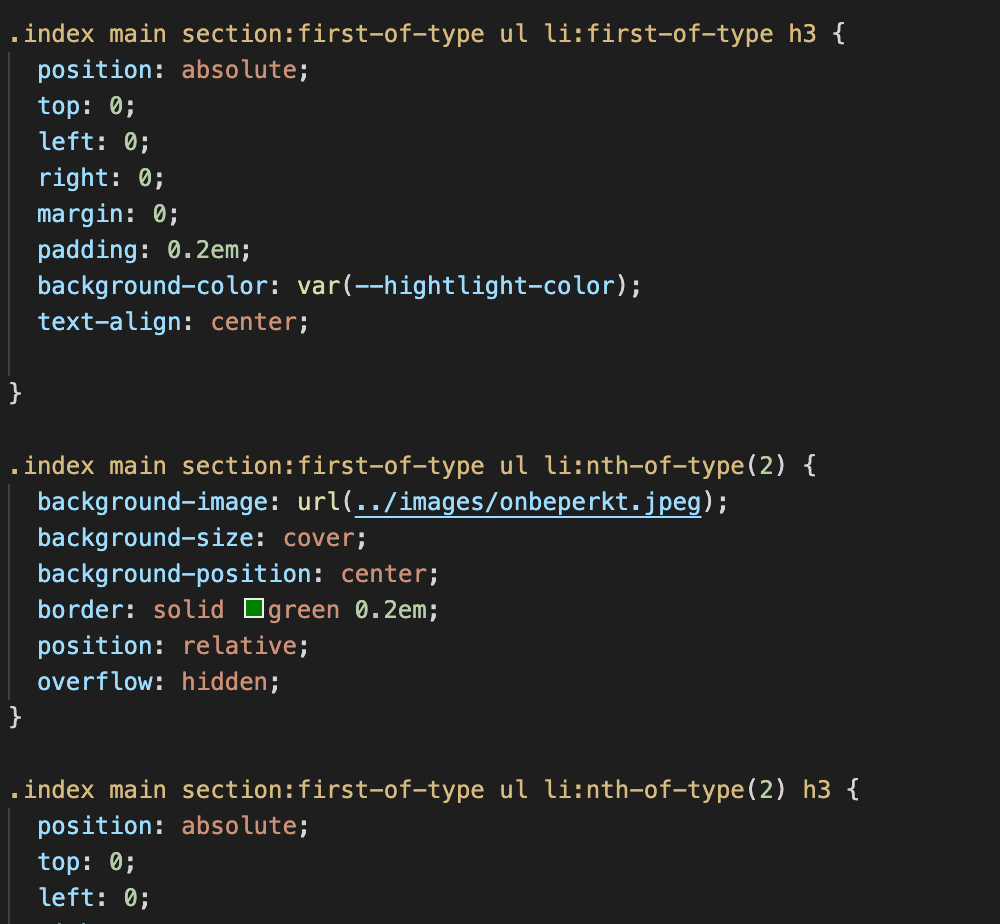
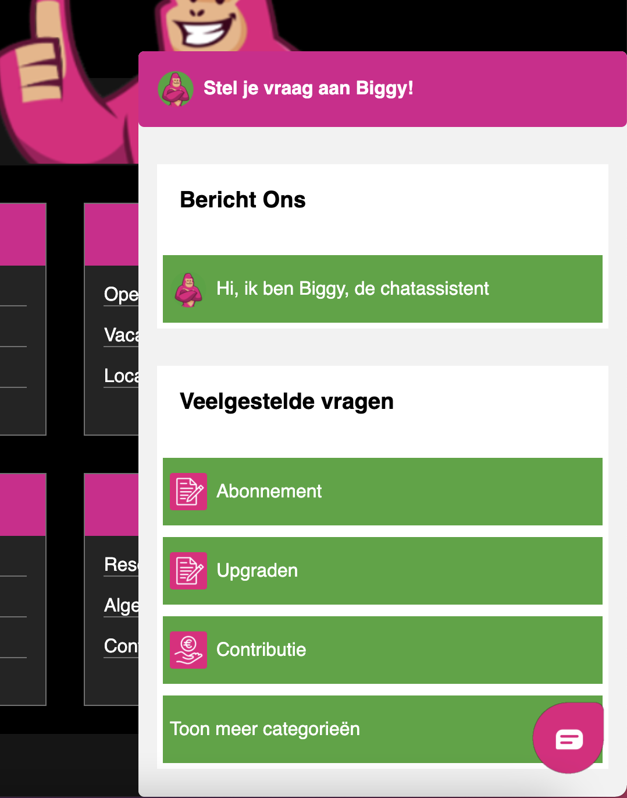
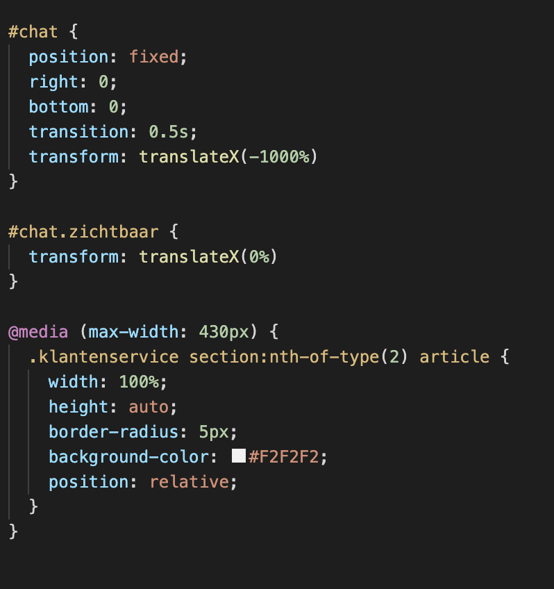
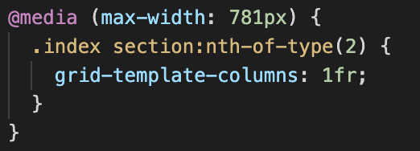
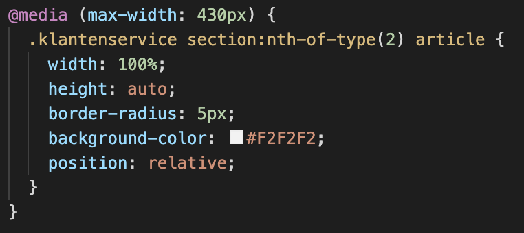
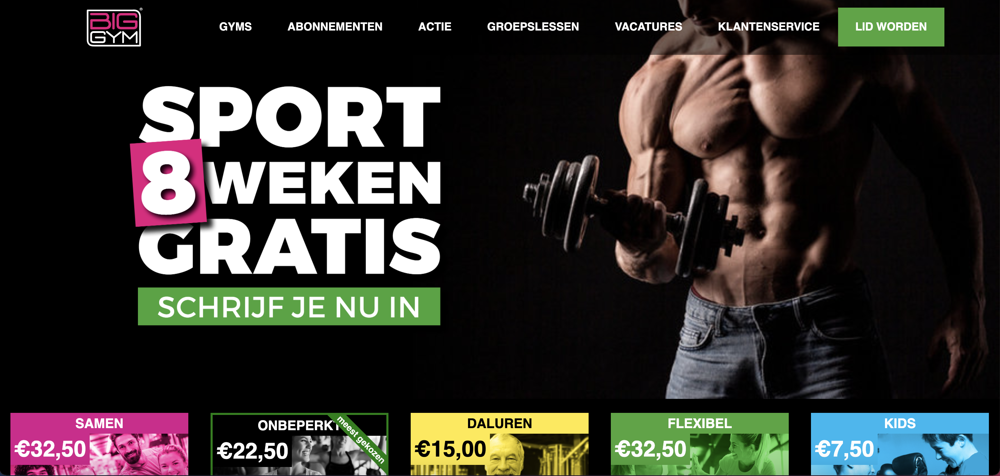
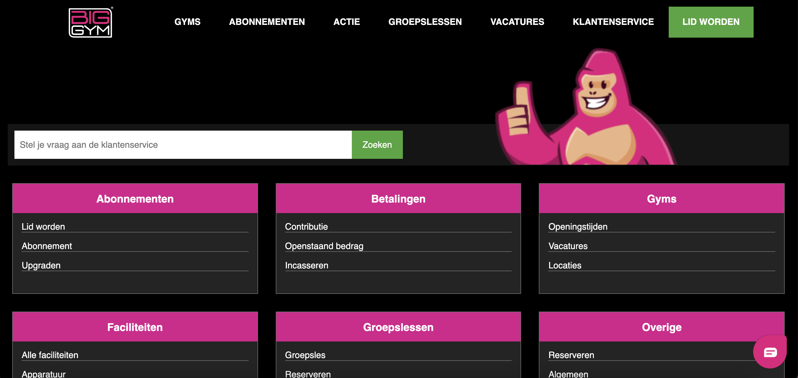
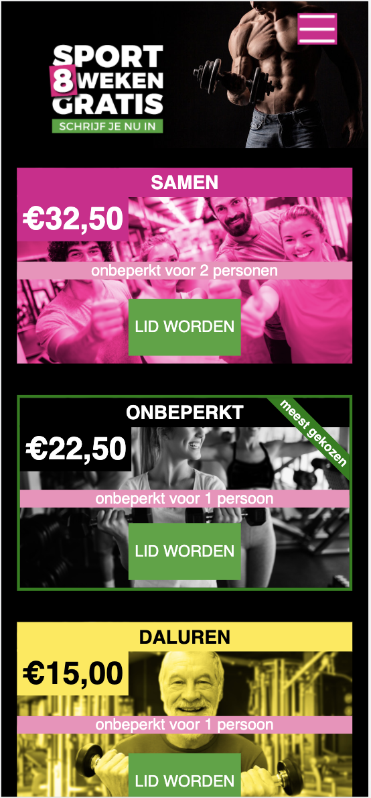
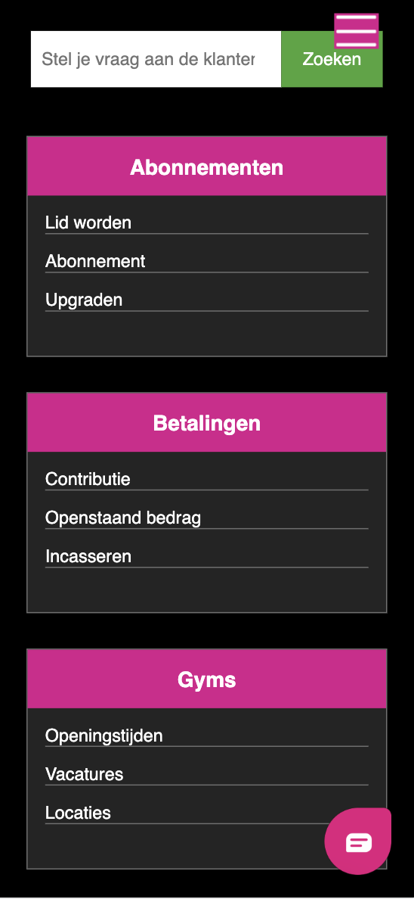

# Procesverslag

## Jij

uitwerken voor kick-off werkgroep

### Auteur:
Michael Wilhelm

#### Je startniveau:
Rood en op sommige vlakken blauw

#### Je focus:
Was surface plane maar is toch responsive geworden.
De site is helemaal responsive
 

## Je website

uitwerken voor kick-off werkgroep

### Je opdracht:
https://biggym.nl

#### Screenshot(s) van de eerste pagina (small screen): Homepage

#### Screenshot(s) van de tweede pagina (small screen): Klantenservice

 

## Breakdownschets (week 1)

uitwerken na afloop 2e werkgroep

### de hele pagina: 

### dynamisch deel (bijv menu): 

## Voortgang 1 (week 2)

uitwerken voor 1e voortgang

### Stand van zaken
Tot nu toe heb ik de navigatie afgemaakt, alleen voor de small screen moet het nog in een hamburger menu vormen (als het goed is gaan we dat nog leren). En ik heb de banner van de website nagemaakt, wel met een andere foto omdat die van de BigGym niet te vinden is.

Ik had wel moeite met het maken van de navigatie, na een uur deed de navigatie totaal niet wat ik wilde en heb ik het maar verwijderd. Daarna ben ik opnieuw begonnen en was het wel gelukt.

### Agenda voor meeting
samen met je groepje opstellen

| Michael      | 
| Of we nog les krijgen in het maken van hamburgermenu's.|                     

### Verslag van meeting

- De navigatie is goed gelukt, probeer alleen minder classes te gebruiken. 

## Voortgang 2 (week 3)

uitwerken voor 2e voortgang

### Stand van zaken
Ik heb bijna de hele homepage af het enige wat ik nog moet doen is de promovideo toevoegen en een footer maken. Het ging niet helemaal flekkeloos, ik kwam er niet helemaal uit hoe ik de de verschillende abonnementen andere kleuren kon geven op het begin maar na het maken van de huiswerkopdrachten kwam ik er al snel achter. 

Ik heb het gedaan met de hulp van de selectoren first-of-type, nth-of-type en last-of-type.

### Agenda voor meeting
samen met je groepje opstellen

| Michael      |          
| Hoe krijg ik de tweede section in het midden van de pagina.| 
| Hoe verander je de grid van 2 koloms naar 1 kolom|

### Verslag van meeting
hier na afloop snel de uitkomsten van de meeting vastleggen

- Haal de display flex op de body weg zodat je niet overal position absolute hoeft te plaatsen.
- Op de tweede-section plaats je een mediaquery om te bepalen wanneer je er 1 kolom van maakt.

## Toegankelijkheidstest (week 4)

toegangelijkheid

### Bevindingen
De screenreader werkte goed!
Perpheral field loss.
Low Contrast.
Motoriek.

#### Screenreader
De screenreader werkte goed, er werd goed vermeld dat een link een link was en de tekst werd goed voorgelezen. Alleen bij sommige afbeeldingen werd niet vermeld dat het een knop of link was. 

Dit kan je in de ALT veranderen door een goede omschrijving te geven.

#### Perpheral field loss 
Leon (proefpersoon) kon het hele scherm goed zien. Hij had alleen moeite met het kijken in de hoeken van zijn ogen (hij zag alleen voor zich). Maar dit had geen enkele invloed op het kijken naar de website.

#### Low contrast
De grijze tekst op de knop in de footer Vacatures was niet goed te lezen.
Dit heb ik verandert naar een donkerdere kleur waardoor het goed te lezen is.

#### Motoriek
Het was erg moeilijk om te scrollen op de laagste stand van het apparaat, hierdoor was het ook erg moeilijk om op knoppen te drukken. Op de hoogste stand was het vrijwel onmogelijk.

Oplossing voor de laagste stand: grotere knoppen en links maken.
Oplossing voor de hoogste stand: spraakcommando's. Door te zeggen wat de computer moet doen.

## Voortgang 3 (week 4)

uitwerken voor 3e voortgang

### Stand van zaken
Deze week heb ik de laatste pagina afgemaakt. Het ging best wel goed en veel sneller dan de eerste pagina. Dit komt denk ik doordat je weer bent ingekomen en dat je sommige dingen hebt behandelt die je eigenlijk iets te laat voor de eerste pagina had behandelt.

Het enige waar ik tegen aan liep was het sliden van het chatsysteem. Ik had eerst de chatsysteem gemaakt (niet werkent) en die moest het scherm in en uit sliden, het duurde een tijdje voordat ik er achter kwam hoe dat ookalweer moest.

### Agenda voor meeting
samen met je groepje opstellen

| Michael      | 
| geen vragen het was gelukt voordat het gesprek kwam | 

### Verslag van meeting

- De site zag er goed uit en was goed responsive.
- Om de aap te laten verdwijnen kan je mediaquery gebruiken net als de navigatie en je bij het chatsysteem doet.

## Eindgesprek (week 5)

uitwerken voor eindgesprek

### Stand van zaken
Het werken met positions vond ik op het begin best lastig en ik had het ook nog nooit gedaan, maar na een tijdje mee te werken ging het eigenlijk best goed. 

Het werken met media querys ging ook heel goed, dit was ook de eerste keer dat ik hier mee werkte maar het is eigenlijk best simpel. Ik keek via de inspector telkens naar de width van het scherm en op welk moment ik iets zou willen veranderen. Dit heb ik gebruikt voor het hamburgermenu, de voordelen section, de form en img en de chatfunctie.

De links in het navigatiemenu en de buttons op de pagina vormgeven ging erg goed, dit had ik dan ook wel een stuk vaker gedaan dan de rest van de code.

### Screenshot(s)

## Bronnenlijst

continu bijhouden terwijl je werkt

1. codepen oefeningen
2. hamburgermenu: https: //www.youtube.com/watch?v=At4B7A4GOPg
3. media query: https://www.w3schools.com/cssref/css3_pr_mediaquery.asp

